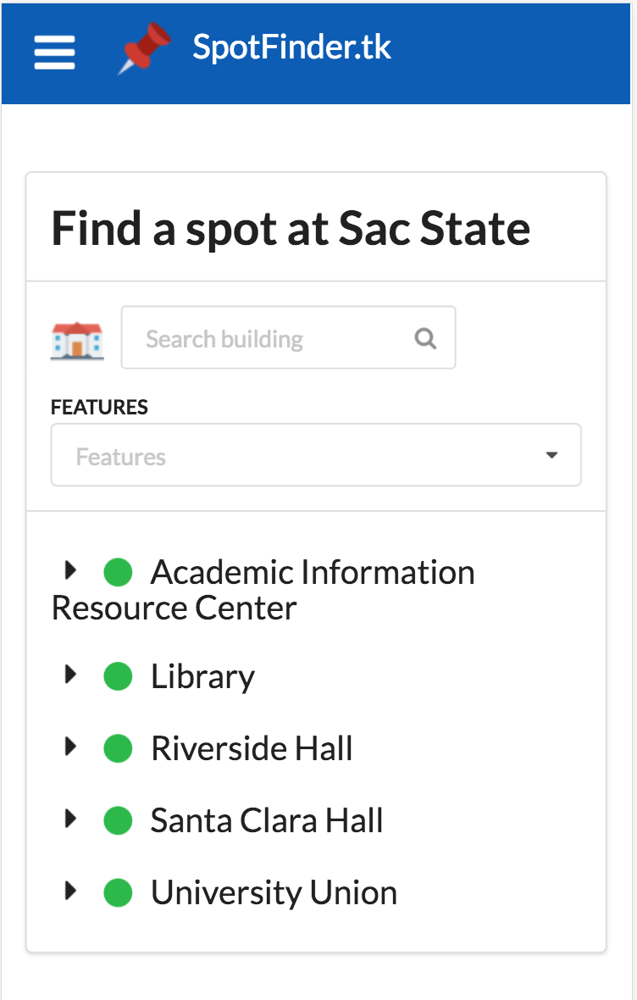
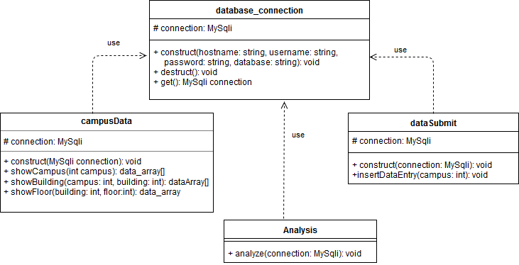

## Report 3
### Cover Page and Individual Contribution

Course title: CSC 131 Section 4 - Computer Software Engineering

Team number: 2

Team name: Team Tux

Project: Study Spot Finder

Project website: www.SpotFinder.tk

Submission date: Monday, December 4, 2017 at 11:59 PM P.D.T.

Team members:

 *  Alex
 *  Edward
 *  Luis Roman
 *  Luke
 *  Nick
 *  Tara Ross
 *  Travis Keri

### Table of contents
 * [Summary of Changes](#changeSummary)
 * [Customer Statement of Requirements](#requirements)
 * [Glossary](#glossary)
 * [Functional Requirments](#functional)
  * [Stakeholders](#stakeholders)
  * [Actors and Goals](#actor)
  * [Use Cases](#usecase)
  * [System Sequence Diagrams](#diagrams)
 * [Nonfunctional Requirements](#nonfunctional)
 * [Use Case Points Effort Estimation](#effortEstimation)
 * [Domain Analysis](#domain_analysis)
  * [Domain Model](#domain_model)
 * [Progress Report and Plan of Work](#progressReportandPOW)
   * [Progress Report](#progressReport)
   * [Plan of Work](#planOfWork)
 * [Interaction Diagrams](#interation)
 <!--Temporary separator just so I can see better -->
 * [Class Diagram and Interface Specification](#interface)
   * [Class Diagram](#classDiagram)
 * [System Architecture and System Design](#system)
   * [Architectural Style](#architecturalStyle)
   * [Identifying Subsystems](#identifyingSubsystems)
   * [Mapping Subsystems to Hardware](#mapping)
   * [Persistent Data Storage](#data)
   * [Network Protocal](#network)
   * [Global Control Flow](#controlFlow)
   * [Hardware Requirements](#hardward)
 * [Algorithms and Data Structures](#algorithmsDataStructures)
   * [Algorithms](#algorithms)
   * [Data Structures](#dataStructures)
 * [User Interface Design and Implementation](#uIDandI)
 * [History of Work](#history)
 * [Conclusion and Future Work](#conclusion)
 * [References](#references)

### Summary of Changes

Most of the changes here are deletions due to having too many extra features on top of the core function of the app. The necessary changes are:

* The ommission of the requirement _"REQ-2: System finds a place near me"_
* The ommission of the requirement _"REQ-6: User can reserve a room"_

### Customer Requirements  
|Requirements|Priority|Description                                                                |
|------------|:------:|---------------------------------------------------------------------------|
|**REQ - 1** |5       |Find place on campus to study                                              |
|**REQ - 2** |3       |System finds a place near me                                               |
|**REQ - 3** |3       |System is easier to use than a map                                         |
|**REQ - 4** |1       |System can find group space                                                |
|**REQ - 5** |2       |System can find quiet(nap) space                                           |
|**REQ - 6** |3       |User can reserve a room                                                    |
|**REQ - 7** |3       |System can search for amenities (locks/whiteboards/outlets/wi-fi/printers) |
|**REQ - 8** |4       |System analyzes data to track trends                                       |
|**REQ - 9** |3       |User can leave comments                                                    

#### Customer Statement of Requirements:

*The Problem*

 Students who attend Sacramento State College seem to have trouble finding a spot to study or do homework.  Students who don’t study or do their assignments tend to not graduate from college.  This is proven by the low graduation rate of 43.3% in 2014.  Since our school is packed with people most of the time, it can be difficult to find a place available to study or do homework.  While it is impossible to make anyone study or do their assignments, our project will help students find places on campus so that they can do their assignments with the amenities they need.
*	Students have busy school/work schedules and it’s hard for them to find time to study
*	Lack of motivation
*	Not being able to find places to study between classes.
*	Not being able to find quiet places to study between classes.
*	Not being able to find a place for a group to work on a project on campus.
*	Unaware of the amenities that can help students work on assignments.
*	No way of knowing real time building/floor availability.

The main problem on campus is finding a spot to study. Many students wonder around throughout the AIRC and the library just trying to find an open spot for either them or their group.  This can result to students becoming stressed out or starting arguments over spots they think are open.  These problems can end up wasting time, which is not ideal, especially with a busy school schedule.

*Our Goal*

Our goal is to make a website that is easy to operate for students to find a spot to study. We also want to foster an active community of students where they are eagerly involved in providing information about the best and worst places to study.

Without this program there would be no way for students to know where the best places to study are, which could lead to students not studying at all which would then lead to students dropping out. We wish to make student's lives easier and also to make school less stressful than it already is.  This program is designed with students in mind, with the simple web layout to the easy to find needed amenities.

With the ideal implementation of our web application, SpotFinder will become a part of every student's daily routine.  The final production build will be good enough to be endorsed by Sacramento State University.  Our web application could be integrated into the Sac State mobile application.  This would allow students to have easy access to our website alongside the many other useful resources within the Sac State App.|

### Glossary
  * Study Space: a place to study, sleep or work in a group
  * Amenities: outlets for charging, quiet, whiteboards, printers, monitors
  * Trends: useage trends for the different study spaces

### Functional Requirements
   * REQ-1: Find place on campus to study
   * REQ-4: System can find group space
   * REQ-7: System can search for amenities (locks/whiteboards/outlets/wifi/printers)
   * REQ-8: System analyzes data to track trends

#### Stakeholders
  * Students: will be able to more effiecntly find and use study spaces
  * School: more attractive to prospective students because of it's high tech efficency
#### Actors and Goals  

 *  Users-Use the system to find places to study
 *  Admins-Manage the system to add or remove locations

#### Use Cases  

<!-- Hey guys, let's just assign our names to these okay? -->
Use Case Description  
 * UC-1 User searches for open study space  
 * UC-2 User searches for study space with amenity  
 * UC-3 User reserves a room  
 * UC-4 System logs user in
 * UC-5 System analyzes trends  			
 * UC-6 User input how busy an area is  
 * UC-7 User leaves comment

 

|Use Case 1         |User searches for open study space                        |
|-------------------|----------------------------------------------------------|
|Related REQs       |REQ1, REQ2, REQ4, REQ5                                    |
|Initiating Actors  |Student                                                   |
|Actor's Goals      |To search for an open study spaces                        |
|Participating Actor|Database                                                  |
|Preconditions      |Search screen is active                                   |
|Postconditions     |Available space displayed                                 |
|Flow of Events     |                                                          |
|->                 |1.User selects the search option                          |
|<-                 |2.System displays the search page                         |
|->                 |3.User looks through open areas                           |
|<-                 |4.Database returns available space in the requested area  |

|Use Case 2         |User searches for a study space with amenity                                        |
|-------------------|------------------------------------------------------------------------------------|
|Related REQs       |REQ1, REQ2, REQ3, REQ7                                                                    |
|Initiating Actors  |Student                                                                             |
|Actor's Goals      |To search for study spaces with amenities(White boards, outlets, good wi-fi, ect...)|
|Participating Actor|None                                                                                |
|Preconditions      |Filter search is on screen                                                          |
|Postconditions     |Search results displayed on screen                                                  |
|Flow of Events     |                                                                                    |
|->                 |1.User selects the search option                                                    |
|<-                 |2.System displays the search page                                                   |
|->                 |3.User selects combatination of available amenities they want to search for         |
|<-                 |4.Database returns availible study areas and how full they are                      |
|Alt. Flow of Events|                                                                                    |
|->                 |3a.User selects combanation of unavailable amenities                                |
|<-                 |	4.Database returns and displays message to refine search                         |

|Use Case 3         |                                  |
|-------------------|----------------------------------|
|Related REQs       |REQ6                              |
|Initiating Actors  |Student                           |
|Actor's Goals      |To reserve a room                 |
|Participating Actor|None                              |
|Preconditions      |Room is empty                     |
|Postconditions     |Room will now be reserved         |
|Flow of Events     |                                  |
|->                 |1. User selects reserve a room option|
|<-                 |2. System displays whether or not room is available|
|->		    |3. User reserves available room   |
|<-		    |4. System displays confirmation   |

|Use Case 4         |System logs user in                                        |
|-------------------|------------------------------------------------------------------------------------|
|Related REQs       |REQ3, REQ6, REQ7                                                                    |
|Initiating Actors  |Student                                                                             |
|Actor's Goals      |To be identified by the system so that the system can record the actor who is reserving a room and link its input as well as comments to itself.|
|Participating Actor|None                                                                                |
|Preconditions      |The actor has a username registered in the database or has a browser with cookies enabled to be allowed to enter to the system as a guest.                                                          |
|Postconditions     |The user is logged in as a registered user or a guest.                                                  |
|Flow of Events     |                                                                                    |
|<-		|1.System displays main menu and prompts for method for system access: username account or guest|
|->                 |2.User submits log in information                                                    |
|<-                 |3.System displays if the user logged in successfully                                                   |
|<-                 |4.System displays option to add input, comments or reserve a room         |
|Alt. Flow of Events|                                                                                    |
|->                 |2a.User has cookies enabled and logs in as a guest                                |
|<-                 |3a.System displays option to add input as to how busy an area is                         |
|Second Alt. Flow of Events| |
|<-|3b. System displays that the user was unable to log in successfully and is returned to the main menu|

|Use Case 5         |System analyzes trends                  |
|-------------------|----------------------------------------|
|Related REQs       | REQ1, REQ2, REQ4, REQ5, REQ6, and REQ8 |
|Initiating Actors  | Admin                                  |
|Actors Goal        | Analyze trends to predict study space  |
|                   | availability                           |
|Participating Actor| Student                                |
|Preconditions      | database is not empty                  |
|Postconditions     | useage trend data is updated           |
|Event Flow         |                                        |
|->                 | update triggers analysis algorithm     |
|<-                 | Database releases updated trend data   |

|Use Case 6          |User inputs how busy an area is                       |
|--------------------|------------------------------------------------------|
|Related REQs        |REQ9                                                  |
|Initiating actors   |Student                                               |
|Actor's goals       |Student can submit how busy an area is                |
|Participating actors|None                                                  |
|Preconditions       |Selection screen for level of space congestion        |
|                    |Button for submitting space congestion level          |
|Postconditions      |Data is submitted and stored in database              |
|**Flow of events**  |**Scenario 1**                                        |
|**->**              |1. _User selects the "Submit" button for current area_|
|**<-**              |2. _System displays options for level of congestion_  |
|**->**              |3a. _User selects either 1, 2 , or 3 on screen_       |
|**<-**              |4a. _System thanks user for submitting feedback_      |
|                    | _System sends user back to floor status page_        |
|**Alternate events**|**Scenario 2**                                        |
|**->**              |3b. _User selects the cancel option_                  |
|**<-**              |4b. _System brings user back to the floor status page_|

|Use Case 7          |User enters a comment                                 |
|--------------------|------------------------------------------------------|
|Related REQs        |REQ9, REQ1                                            |
|Initiating actors   |Student                                               |
|Actor's goals       |Student can comment anything about a room             |
|Participating actors|None                                                  |
|Preconditions       |Selection of room                                     |
|                    |Text field for inputting comments                     |
|Postconditions      |Comment is submitted and stored in database           |
|**Flow of events**  |**Scenario 1**                                        |
|**->**              |1. _User selects a floor/room to comment on_          |
|**<-**              |2. _System displays a text box_                       |
|**->**              |3a. _User enters and submits a comment_               |
|**<-**              |4a. _System adds comment to db_                       |
|**Alternate events**|**Scenario 2**                                        |
|**->**              |3b. _User selects the cancel option_                  |
|**<-**              |4b. _System closes text box, but stays on the page_   |

**Traceability Matrix**  

|**Req't**|**PW**|UC1|UC2|UC3|UC4|UC5|UC6|UC7|
|---------|:----:|:-:|:-:|:-:|:-:|:-:|:-:|:-:|
|REQ1     |5     |X  |X  |   |   |X  |   | X |
|REQ2     |3     |X  |X  |   |   |X  |   |   |
|REQ3     |3     |   |   |   |X  |   |   |   |
|REQ4     |1     |X  |   |   |   |X  |   |   |
|REQ5     |2     |X  |   |   |   |X  |   |   |
|REQ6     |3     |   |   |X  |X  |X  |   |   |
|REQ7     |3     |   |X  |   |X  |   |   |   |
|REQ8     |4     |   |   |   |   |X  |   |   |
|REQ9     |3     |   |   |   |   |   |X  | X |
|MAX PW   |      |5  |5  |3  |3  |5  |3  | 5 |
|Total PW |      |11 |11 |3  |9  |18 |3  | 8 |

#### System Sequence Diagrams

### Nonfunctional Requirements

  * REQ-3: System is easier to use than a map
  * REQ-5: System can find a quiet (nap) space
  * REQ-9: User can leave comments

#### Use Case Points Effort Estimation

    Unadjusted Actor Weights

|Actor Name|Description                                   |Complexity|Weight|
|----------|----------------------------------------------|:--------:|:----:|
|Student   |Student interacts though a web based interface|Average   |2     |

Use Case Weights

|Use Case|Description                                  |Category|Weight|
|:------:|---------------------------------------------|:------:|:----:|
|UC-1    |Student searches for an open study space     |Average |10    |
|UC-2    |Student searches for study space with amenity|Average |10    |
|UC-4    |System logs user in                          |Average |10    |
|UC-5    |System analyzes trend                        |Average |10    |
|UC-6    |User input how busy an area is               |Average |10    |
|Total   |                                             |        |50    |

Unadjusted UCP (UUCP) = Unadjusted Actor Weights + Use Case Weights = 52

Technical Complexity Factor (TCF)

|Technical Factor|Discription                       |Weight|Preceived Complexity|Calculated Factor|
|----------------|----------------------------------|:----:|:------------------:|:---------------:|
|T1              |Web based system                  |2     |2                   |2 X 2 = 4        |
|T2              |User expect good runtimes         |1     |3                   |1 X 3 = 3        |
|T3              |Needs to be efficient             |1     |2                   |1 X 2 = 2        |
|T4              |Internal processing is simple     |1     |1                   |1 X 1 = 1        |
|T5              |No reuseability required          |1     |0                   |1 X 0 = 0        |
|T6              |No install required               |0.5   |0                   |0.5 X 1 = 0      |
|T7              |Fairly easy to use                |0.5   |2                   |0.5 X 2 = 1      |
|T8              |Needs to work on any moble device |2     |2                   |2 X 2 = 4        |
|T9              |Easy to change                    |1     |3                   |1 X 3 = 3        |
|T10             |Concurrent use is required        |1     |3                   |1 X 3 = 3        |
|T11             |Security is a minimal concern     |1     |3                   |1 X 3 = 3        |
|T12             |No direct access for third parties|1     |0                   |1 X 0 = 0        |
|T13             |No training required              |1     |0                   |1 X 0 = 0        |
|Total           |                                  |      |                    |24               |

**TCF**  0.6 + 0.1 X 24 = **0.84**

Environmental Complexity Factor (ECF)

|Enviromental Factor|Desctiption                                  |Weight|Preceived Impact|Calculated Factor|
|-------------------|---------------------------------------------|:----:|:--------------:|:---------------:|
|E1                 |Beginner familiarity with development process|1.5   |1               |1.5 X 1 = 1.5    |
|E2                 |No familiarity with appication problem       |0.5   |1               |0.5 X 1 = 0.5    |
|E3                 |Some knowledge of object-oriented approach   |1     |2               |1 X 2 = 2        |
|E4                 |No lead                                      |0.5   |0               |0.5 X 0 = 0      |
|E5                 |Mid level motivation                         |1     |2               |1 X 2 = 2        |
|E6                 |Stable requirements                          |2     |5               |2 X 5 = 10       |
|E7                 |All part time staff                          |-1    |4               |-1 X 4 = -4      |
|E8                 |Easy programming language                    |-1    |1               |-1 X 1 = -1      |
|Total              |                                             |      |                |11               |

**ECF** 1.4 - 0.3 X 11 = 1.07

Use Case Points (UCP) = UUCP x TCF X ECF = 52 X 0.84 X 1.07 = 46.73 = 47

**Project Duration Estimation**  = 47 X 30 = 1410 Man Hours

### Domain Analysis

#### Domain Model

### System Architecture and System Design

#### Architecural Style

For our archictecture we used a central database to store all data.  It is a MYSQL database. The webserver pulls all data from this one database.

#### Identifying Subsystems

  
   
    The three subsystems are the client's browser, the server, and the database.  The client will access the server and the server retrieve data from the database.

#### Mapping Subsystems to Hardware

    There is a server that serves a website.  
    Users are able to access the webpage with a web browser.  The UI that the user interacts with
    is run on the user's computer that is being used to visit the webpage.  The web server
    runs on a linux machine that is being hosted remotely.  
#### Persistent Data Storage

Yes, we are using a relational database for data storage.  There are _seven_ tables.

1. Data Table     - Stores the user input as an int, and is associated with a floor, campus, and building id.

2. Building Table - Stores information about the building that will apply to all floors.

3. Floor Table    - Stores information about each floor, and is associated with the building id.

4. Campus Table   - Stores information about the various campuses, has a campus id.

5. Features Table - Stores information about the different features a floor can have, each feature is a column.

6. Cached_Data Table - Stores cached data about each floor, and is associated with building, floor, and campus ids

7.  User Table - Stores the log in info for user accounts, has a hashed password and a username and email.

#### Network Protocal

We are using HTTP. We chose HTTP simply because the majority of the group had some experience with HTTP, and it is easy to work with.  This is the network protocal that our framework of choice uses.

#### Global Control Flow

  ##### Execution Orderness

    The system is not procedure driven.  The user has the ability to select which part of
    the website that they would like to interact with.  There is no specific order that the
    client has to interact with the website.  

  ##### Time Dependency

    There are automated algorithms that will run at specific times in the day.  
    These are realtime events that occur periodically.  The algorithms are for caching analyzed trends.

  ##### Concurrency

    This system will run on an apache server.  That server will handle multiple requests
    and allow for serveral users.  The users will all access the same database.  The apache php
    will be single threaded.

#### Hardware Requirements

    The system runs on a linux box that is remotely hosted.  The server only need about 1GB of
     space and a single core allocated to host and serve content.  To use the system, the client needs
    to have a computer capable of visiting a webpage.  

### Algorithms and Data Structures

#### Algorithms

  
Log In 
Pseudo-code:  

//variable holding username provided 
$providedUser; 
//variable holding password provided 
$providedPassword; 
//check if user is in database
 if(doesUserExist($providedUser)){
     //if successful then compare with password
     if(logIn($providedUser,$providedPassword)){
         //if successfull then log in and redirect to page for users logged in
         $user=$providedUser;
         request('/account/logIn');
     }
 }

  
Data Cache 
Pseudo-code:  

//pull all data for a given floor at the current hour  

//calculate the average value of all the data submissions for that floor  

//use that average to store a cached value of the overall "fullness" of the floor.  

#### Data Structures
Arrays
 The application developed makes use of multiple two dimensional or three dimensional arrays to minimize the amount of times the information is consulted to the database.
 
 Arrays of two dimensions are as follows:
 
 Array_of_Campuses{
     Array_of_CSUS_Campus[
         Array_of_AIRC_Floors('Floor 1' => trafficInFloorValue1, 'Floor 2' => trafficInFloorValue2),
         Array_of_Library_Floors('Floor 1' => trafficInFloorValue1, 'Floor 2' => trafficInFloorValue2)
     ],
     Array_of_Davis_Campus[
         Array_of_StudentCenter_Floors('Floor 1' => trafficInFloorValue1, 'Floor 2' => trafficInFloorValue2),
         Array_of_Library_Floors('Floor 1' => trafficInFloorValue1, 'Floor 2' => trafficInFloorValue2)
     ]
 }
 
 Algorithms that the team expects to develop will pull the necessary data as needed in order to display it in the appropiate manner on the graphical user interface.
 
 Hashed Tables
 
 Hashing tables haven't been designed and are expected to be developed to protect the user's password in the database for increased protection. These passwords will be unrecoverable and new ones have to be created if the user wants to restore their account due to forgotten paswords.

### User Interface Design and Implementation

#### Find Spot
The user will start at the "Find a Spot" page, which will display what campus you are at and a search prompt to find desired building. Below, there is a list of all the buildings that can be clicked on to show the availability for each floor the building has.

#### Menu
The sidebar menu will be available to the user at all times.  One tap on the menu icon will pull up the menu and allow the user to easily navigate the site. Can choose between "Find a Spot", "My Account", and "Support"

#### Login Page
User can login to original account or create a new account, if they are new to the site.

#### Scenario 1: User looks for any open area nearby.
1. Navigation: 1 Total Click
* User clicks on one of the nearby listed building for information about open rooms.
2. Data Entry: None
3. Fraction of Nav vs Data Entry (Nav/Data)
* All Navigation

#### Scenario 2: User looks for any open areas, with desired features, nearby.
 -1. Navigation: 1 Total Click
 -* User clicks on desired features.

#### Scenario 3: User contributes data for a room.
 -1. Navigation: 4 Total Clicks
 -* User clicks on one of the nearby listed buildings for information about open rooms.
 -* User clicks "Update Status"
 -* User selects the fullness of the floor
 -2. Data Entry: 1 click
 -* User click one of the three options for how full a room is
 -3. Fraction of Nav vs Data Entry (Nav/Data)
 -* 4/1

### Progress Report and Plan of Work

### Use Cases implemented so far:

|Implemented     |Use Case Description                               |
|----------------|---------------------------------------------------|
|**In progress** | * UC-1 User searches for open study space         |
|**In Progress** | * UC-2 User searches for study space with amenity |
|**No**          | * UC-3 User reserves a room                       |
|**In progress** | * UC-4 System logs user in                        |
|**In progress** | * UC-5 System analyzes trends                     |
|**In limbo**    | * UC-6 User input how busy an area is             |
|**Not yet**     | * UC-7 User leaves comment                        |

### UC-1
    A search bar has been added to the front page of the website.
### UC-2
    Amenities can now be chosen through a drop down accordian menu.
### UC-3
    Reserving of rooms has not been implemented yet.
### UC-4
    Login page accessible from the side menu with option to sign up.
### UC-5
    A working algorithm has not been started on yet.
### UC-6
    No user access but admins can change traffic status.
### UC-7
    Option for users to leave comments have not been implemented yet.

### Breakdown of Responsibilities

|Task           |Members               |
|---------------|----------------------|
|Coordinator    |Edward                |
|JavaScript     |_Edward, Alex_        |
|HTML/CSS       |_Nick_                |
|Algorithms     |_Travis_              |
|Backend        |_Luke, Luis, Tara_    |

### Interation Diagram

**Use case 1 & 2**

**Use case 3**

We have decided to put this use case on hold, to focus on the others. If there is time to implement them we will come back to them.

**Use case 4**

**Use case 5**

**Use case 6**

**Use case 7**

### Class Diagram and Interface Specification

#### Class Diagram

<!--PLACEHOLDER-->
### System Architecture and System Design

#### Architecural Style

For our archictecture we used a central database to store all data.  It is a MYSQL database. The webserver pulls all data from this one database.

#### Identifying Subsystems

  
   
    The three subsystems are the client's browser, the server, and the database.  The client will access the server and the server retrieve data from the database.

#### Mapping Subsystems to Hardware

    There is a server that serves a website.  
    Users are able to access the webpage with a web browser.  The UI that the user interacts with
    is run on the user's computer that is being used to visit the webpage.  The web server
    runs on a linux machine that is being hosted remotely.  
#### History of Work

	The initial design was meant to use Java but we decided to go with
	php in order to use a framework that makes the U.I. easier to develop.
	After starting with php we began a structured design that we had to
	re work into classes upon conflicts with report specifications from
	management.  What started as a bit of a top down decision making process
	was quickly turned into an excercise in changing the lower level to
	spec and the U.I.  Both strutured and object oriented approaches
	revolve around the MySql database connection although the class design
	did recieve an overhaul between reports.  The current design is modular
	enough to leave room for extension.

#### Conclusion and Future Work

  **Back End**

  Early technical challenges began with the selection of the back end language. Initially the team decided to go for the implementation of Java to process all the computations on the back end with the assistance of the Spring Framework. However, since no one in the team was familiar with the framework, the team decided to proceed with an easier language and PHP was chosen. PHP doesn't have a steep learning curve and with the use of Slim Framework the back end developers were able to proceed smoothly throughout the development.

  **Framework**

  The Slim Framework had some minor difficulties that lied on the fact that documentation was limited and the community is small. These disadvantages didn't pose a threat to the project as the framework was very minimalistic and its code is short and easy to understand. As oposed to Laravel, the Slim framework can be learned in a single weekend with minimal technical proficiency on PHP.

  **Templating System**

  A greater technical challenged was posed by the implementation of the templating system of choice. In the project, it was decided that Twig would be the most convenient way to deliver the website to the end user. Twig allowed for cleaner and a more secure system that facilitated the development of the project. However, this required to adopt different working  methodologies that were complaint with Twig.

  **Security Flaws**

  During the development it was discovered that the server had multiple failed login attempts. This lead to the team taking actions to secure the server and limit access to SSH keys, changing default ports, and follow the most common practices to ensure that the integrity of the system was preserved.

  In addition to this, the team made a backup of the contents in the database in case data corruption were to happen by external threats or accidents.

  **Coding Practices**

  As the project began to grow, the team encountered architectural disadvantages with the initial design and the team was forced to redesign and refactor the code to facilitate future work.

  **Software Engineering Techniques**

  Software Engineering Techniques allowed the team to deal with these technical difficulties in a prompt and efficient manner. Communication among members, as well as good working practices in the coding area and the repository, allowed for mutual clear communication among members that enhanced the productivity and end product of the project.

  **Suggestions and Lessons**

  Due to time constraints the team was limited to the different approaches that could have taken place to develop the product. In early days of development, the approach taken by team members was a "hacking" approach, that involved learning as the challenged was posed. However, this dismissed proper coding practices and often lead to inefficient code that had to be replaced in the future. It was discovered that by learning properly with books and documentation, and only then recurring to forums, once the coder is educated he/she can develop better code that follow the standards which would allow for better maintainability.

  **Useful Background**

  Experience in basic coding techniques by the part of all members allowed the team to learn swiftly through the different technologies. Some team members were knowledgeable about some very specific technologies that proved useful at the time the server had to be setup. Having a basic understanding in Linux and Apache allowed to team to save time and resources in the setup of the server.

  **Future Work**

  At the end, the project opened doors to a range of ideas such as extending this to parking lots at schools as well as the implementation of infrared sensors to produce accurate information for a minimal initial investment.

#### References

* [HTML](https://www.w3schools.com/html/)

* [CSS](https://www.w3schools.com/css/)

* [JavaScript](https://www.w3schools.com/js/)

* [PHP](http://php.net/docs.php)

* [Slim Framework](https://www.slimframework.com)

* [LAMP Server](https://www.digitalocean.com/community/tutorials/how-to-install-linux-apache-mysql-php-lamp-stack-on-ubuntu-14-04)

* [Semantic UI](https://semantic-ui.com)
