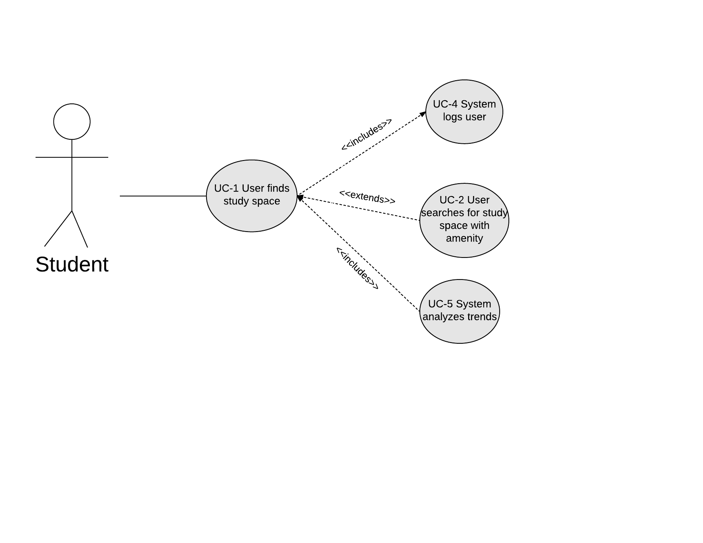
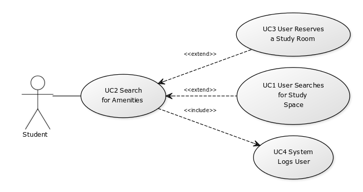
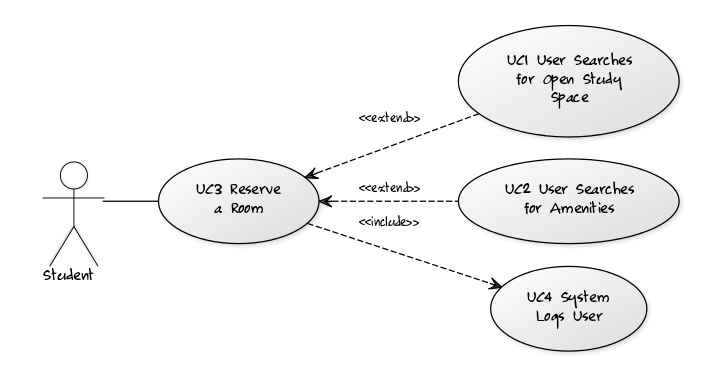
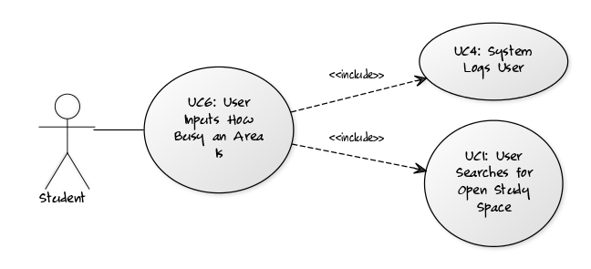
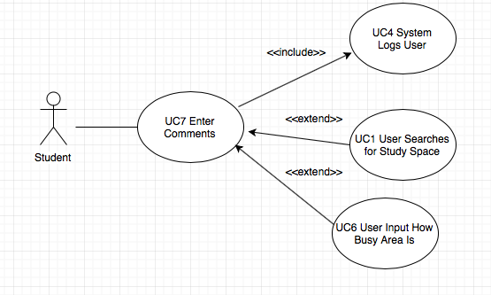
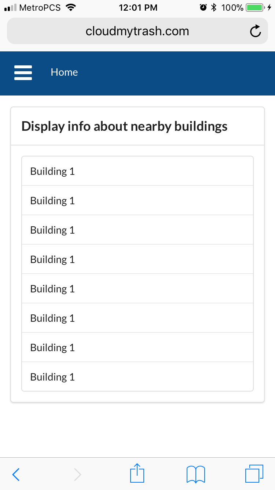
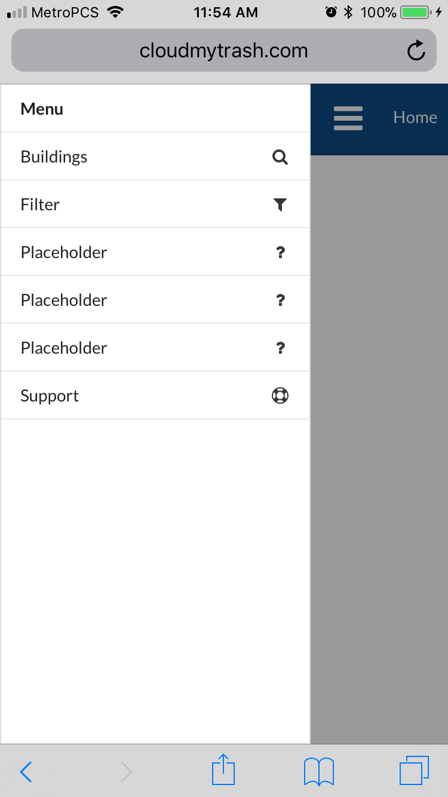

## Report #1
### Cover Page and Individual Contribution

Course title: CSC 131 Section 4 - Computer Software Engineering

Team number: 3

Team name: Team Tux

Project: Study Spot Finder

Project website: www.SpotFinder.tk

Submission date: Monday, September 25, 2017 at 5:00 PM P.D.T.

Team members:

 *  Alex
 *  Edward
 *  Luis Roman
 *  Luke
 *  Nick
 *  Tara Ross
 *  Travis

Individual Contribution:

### Table of contents  
* [Project Proposal](http://cloudmytrash.com:1234/tux-proposal.html)
* [Customer Requirements](#requirements)
* [Glossary](#glossary)
* [Functional Requirments](#functional)
  * [Stakeholders](#stakeholders)
  * [Actors and Goals](#actor)
  * [Use Cases](#usecase)
  * [System Sequence Diagrams](#diagrams)
* [Nonfunctional Requirements](#nonfunctional)
* [Domain Analysis](#domain_analysis)
  * [Domain Model](#domain_model)
  * [System Operation Contracts](#contracts)
  * [Mathematical Model](#math_model)
* [User Interface Design](#ui_design)
  * [Preliminary Design](#prelim_design)
  * [User Effort Estimation](#effort)
* [Plan of Work](#plan)
* [References](#ref)

### Customer Requirements  
|Requirements|Priority|Description                                                                |
|------------|:------:|---------------------------------------------------------------------------|
|**REQ - 1** |5       |Find place on campus to study                                              |
|**REQ - 2** |3       |System finds a place near me                                               |
|**REQ - 3** |3       |System is easier to use than a map                                         |
|**REQ - 4** |1       |System can find group space                                                | 
|**REQ - 5** |2       |System can find quiet(nap) space                                           |
|**REQ - 6** |3       |User can reserve a room                                                    |
|**REQ - 7** |3       |System can search for amenities (locks/whiteboards/outlets/wi-fi/printers) |
|**REQ - 8** |4       |System analyzes data to track trends                                       |
|**REQ - 9** |3       |User can leave comments                                                    |

### Glossary

### Functional Requirements

#### Stakeholders

#### Actors and Goals  

 *  Users-Use the system to find places to study 
 *  Admins-Manage the system to add or remove locations 

#### Use Cases  

 

<!-- Hey guys, let's just assign our names to these okay? -->
Use Case Description  
 * UC-1 User searches for open study space  **_(Nick)_**
 * UC-2 User searches for study space with amenity  **_(Travis)_**
 * UC-3 User reserves a room  **_(Tara)_**
 * UC-4 System logs user  **_(Luis)_**
 * UC-5 System analyzes trends  **_(Luke)_**			
 * UC-6 User input how busy an area is  **_(Alex)_**
 * UC-7 User leaves comment  **_(Edward)_**
 
 

|Use Case 1         |User searches for open study space                        |
|-------------------|----------------------------------------------------------|
|Related REQs       |REQ1, REQ2, REQ4, REQ5                                    |
|Initiating Actors  |Student                                                   |
|Actor's Goals      |To search for an open study spaces                        |
|Participating Actor|Database                                                  |
|Preconditions      |Search screen is active                                   |
|Postconditions     |Available space displayed                                 |
|Flow of Events     |                                                          |
|->                 |1.User selects the search option                          |
|<-                 |2.System displays the search page                         |
|->                 |3.User looks through open areas                           |
|<-                 |4.Database returns available space in the requested area  |

|Use Case 2         |User searches for a study space with amenity                                        |
|-------------------|------------------------------------------------------------------------------------|
|Related REQs       |REQ1, REQ2, REQ7                                                                    |
|Initiating Actors  |Student                                                                             |
|Actor's Goals      |To search for study spaces with amenities(White boards, outlets, good wi-fi, ect...)|
|Participating Actor|None                                                                                |
|Preconditions      |Filter search is on screen                                                          |
|Postconditions     |Search results displayed on screen                                                  |
|Flow of Events     |                                                                                    |
|->                 |1.User selects the search option                                                    |
|<-                 |2.System displays the search page                                                   |
|->                 |3.User selects combatination of available amenities they want to search for         |
|<-                 |4.Database returns availible study areas and how full they are                      |
|Alt. Flow of Events|                                                                                    |
|->                 |3a.User selects combanation of unavailable amenities                                |
|<-                 |	4.Database returns and displays message to refine search                         |

|Use Case 3         |                                  |
|-------------------|----------------------------------|
|Related REQs       |REQ6                              |
|Initiating Actors  |Student                           |
|Actor's Goals      |To reserve a room                 |
|Participating Actor|None                              |
|Preconditions      |Room is empty                     |
|Postconditions     |Room will now be reserved         |
|Flow of Events     |                                  |
|->                 |1. User selects reserve a room option|
|<-                 |2. System displays whether or not room is available|
|->		    |3. User reserves available room   |
|<-		    |4. System displays confirmation   | 

|Use Case 5         |System analyzes trends                  |
|-------------------|----------------------------------------|
|Related REQs       | REQ1, REQ2, REQ4, REQ5, REQ6, and REQ8 |
|Initiating Actors  | Admin                                  |
|Actors Goal        | Analyze trends to predict study space  |
|                   | availability                           |
|Participating Actor| Student                                |
|Preconditions      | database is not empty                  |
|Postconditions     | useage trend data is updated           |
|Event Flow         |                                        |
|->                 | update triggers analysis algorithm     |
|<-                 | Database releases updated trend data   |

|Use Case 6          |User inputs how busy an area is                       |
|--------------------|------------------------------------------------------|
|Related REQs        |REQ9                                                  |
|Initiating actors   |Student                                               |
|Actor's goals       |Student can submit how busy an area is                |
|Participating actors|None                                                  |
|Preconditions       |Selection screen for level of space congestion        |
|                    |Button for submitting space congestion level          |
|Postconditions      |Data is submitted and stored in database              |
|**Flow of events**  |**Scenario 1**                                        |
|**->**              |1. _User selects the "Submit" button for current area_|
|**<-**              |2. _System displays options for level of congestion_  |
|**->**              |3a. _User selects either 1, 2 , or 3 on screen_       |
|**<-**              |4a. _System thanks user for submitting feedback_      |
|                    | _System sends user back to floor status page_        |
|**Alternate events**|**Scenario 2**                                        |
|**->**              |3b. _User selects the cancel option_                  |
|**<-**              |4b. _System brings user back to the floor status page_|

|Use Case 7          |User enters a comment                                 |
|--------------------|------------------------------------------------------|
|Related REQs        |REQ9, REQ1                                            |
|Initiating actors   |Student                                               |
|Actor's goals       |Student can comment anything about a room             |
|Participating actors|None                                                  |
|Preconditions       |Selection of room                                     |
|                    |Text field for inputting comments                     |
|Postconditions      |Comment is submitted and stored in database           |
|**Flow of events**  |**Scenario 1**                                        |
|**->**              |1. _User selects a floor/room to comment on_          |
|**<-**              |2. _System displays a text box_                       | 
|**->**              |3a. _User enters and submits a comment_               |
|**<-**              |4a. _System adds comment to db_                       |
|**Alternate events**|**Scenario 2**                                        |
|**->**              |3b. _User selects the cancel option_                  |
|**<-**              |4b. _System closes text box, but stays on the page_   |

**Traceability Matrix**  

|**Req't**|**PW**|UC1|UC2|UC3|UC4|UC5|UC6|UC7|
|---------|:----:|:-:|:-:|:-:|:-:|:-:|:-:|:-:|
|REQ1     |5     |X  |X  |   |   |X  |   | X |
|REQ2     |3     |X  |X  |   |   |X  |   |   |
|REQ3     |3     |   |   |   |   |   |   |   |
|REQ4     |1     |X  |   |   |   |X  |   |   |
|REQ5     |2     |X  |   |   |   |X  |   |   |
|REQ6     |3     |   |   |X  |   |X  |   |   |
|REQ7     |3     |   |X  |   |   |   |   |   |
|REQ8     |4     |   |   |   |   |X  |   |   |
|REQ9     |3     |   |   |   |   |   |X  | X |
|MAX PW   |      |5  |5  |3  |   |5  |3  | 5 |
|Total PW |      |11 |11 |3  |   |18 |3  | 8 |

#### System Sequence Diagrams

### Nonfunctional Requirements

  * REQ-3: System is easier to use than a map
  * REQ-5: System can find a quiet(nap) space
  * REQ-9: User can leave comments

### Domain Analysis

#### Domain Model

#### System Operation Contracts

#### Mathematical Model

### User Interface Design

####  Preliminary Design
#### Home Page

   The user will start at the home page, which will display information about buildings that the user is near.
   Here the user can see a summary of the buildings and select one from  the list for further information.
 
 

 

#### Menu

   The sidebar menu will be available to the user at all times.  One tap on the menu icon will pull up the menu and allow the user to easily navigate the site. 
 
 

 

#### Submit Page

   Here the user can input how crowded a room is with a simple form after selecting a building. 
 
 

 

#### Status Page

   This page will display the rooms/floors and whether or not they are busy. 
 
 

 

#### Filter Page

   Here the user can filter buildings and rooms based on certain amenities and search criteria to find a place to study that suits their needs.
 
 

#### User Effort Estimation

#### Scenario 1: User looks for any open areas nearby

1. Navigation: 1 Total Click

* User clicks on one of the nearby listed buildings for information about open rooms

2. Data Entry: None

3. Fraction of Nav vs Data Entry (Nav/Data)

* All Navigation

#### Scenario 2: User looks for any open areas nearby

1. Navigation: 3 Total Clicks

* User clicks to open the menu

* User clicks "filter" from the menu

* User enters form and clicks submit 

2. Data entry: 2-10 clicks

* Select options from checkmark form

* Click Search to display rooms matching criteria

3. Fraction of Nav vs Data Entry (Nav/Data)

* Depending on Options Selected: 3/2 - 3/10

#### Scenario 3: User contributes data for a room

1. Navigation: 4 Total Clicks

* User clicks on one of the nearby listed buildings for information about open rooms

* User clicks "update status" 

* User fills out form 

* User clicks submit

2. Data Entry: 1 click

* User click one of three options for how full a room is

3. Fraction of Nav vs Data Entry (Nav/Data)

*  4/1

### Plan of Work

### References
