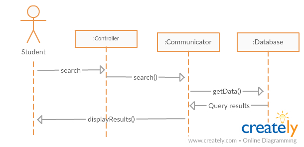
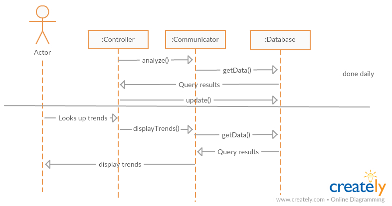
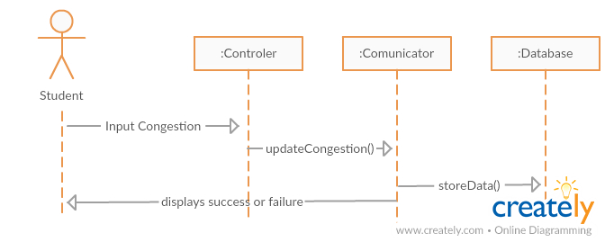
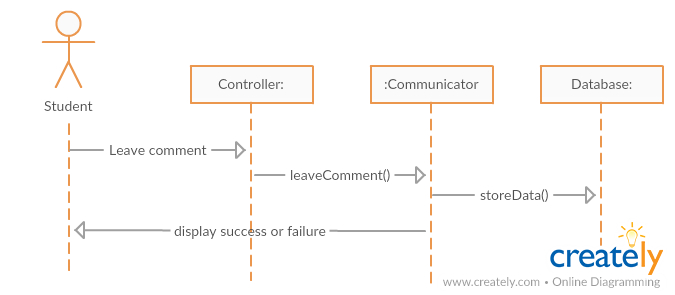

## Report 2
### Cover Page and Individual Contribution

Course title: CSC 131 Section 4 - Computer Software Engineering

Team number: 2

Team name: Team Tux

Project: Study Spot Finder

Project website: www.SpotFinder.tk

Submission date: Monday, September 25, 2017 at 5:00 PM P.D.T.

Team members:

 *  Alex
 *  Edward
 *  Luis Roman
 *  Luke
 *  Nick
 *  Tara Ross
 *  Travis Keri

### Table of contents
 * [Interation Diagrams](#interation)
 * [Class Diagram and Interface Specification](#interface)
   * [Class Diagram](#classDiagram)
   * [Data Types and Operation Signatures](#dataTypes)
 * [System Architecture and System Design](#system)
   * [Architectural Style](#architecturalStyle)
   * [Identifying Subsystems](#identifyingSubsystems)
   * [Mapping Subsystems to Hardware](#mapping)
   * [Persistent Data Storage](#data)
   * [Network Protocal](#network)
   * [Global Control Flow](#controlFlow)
   * [Hardware Requirements](#hardward)
 * [Algorithms and Data Structures](#algorithmsDataStructures)
   * [Algorithms](#algorithms)
   * [Data Structures](#dataStructures)
 * [User Interface Design and Implementation](#uIDandI)
 * [Progress Report and Plan of Work](#progressReportandPOW)
   * [Progress Report](#progressReport)
   * [Plan of Work](#planOfWork)

### Interation Diagram

**Use case 1 & 2**

**Use case 3 & 4**

We have decided to put this use case on hold, to focus on the others. If there is time to implement them we will come back to them.

**Use case 5**

**Use case 6**

**Use case 7**

### Class Diagram and Interface Specification

#### Class Diagram

#### Data Types and Operation Signatures

### System Architecture and System Design

#### Architecural Style

#### Identifying Subsystems

#### Mapping Subsystems to Hardware

#### Persistent Data Storage

#### Network Protocal

#### Global Control Flow

#### Hardware Requirements

### Alorithms and Data Structures

#### Algorithms

#### Data Structures

### User Interface Design and Implementation

### Progress Report and Plan of Work

#### ProgressReport

#### Plan of Work

