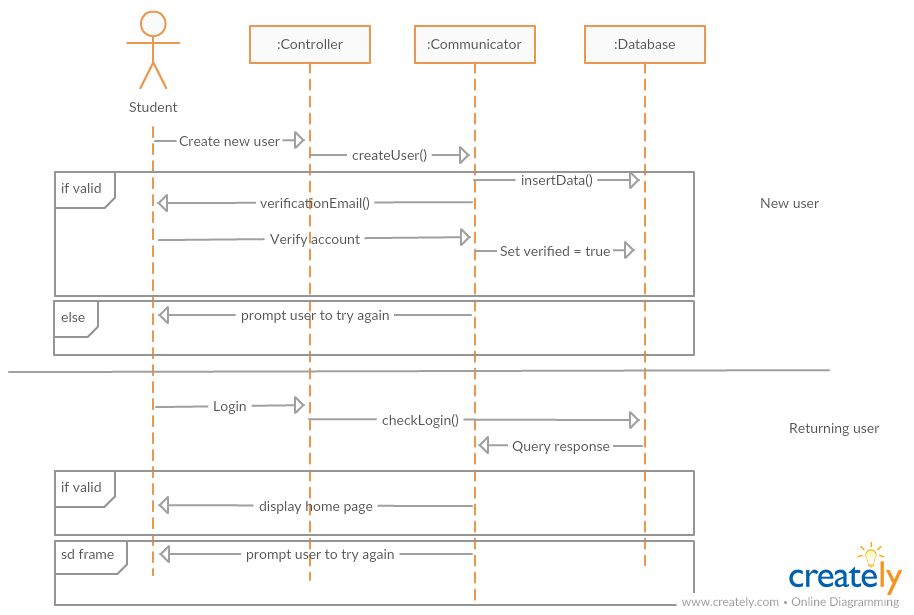
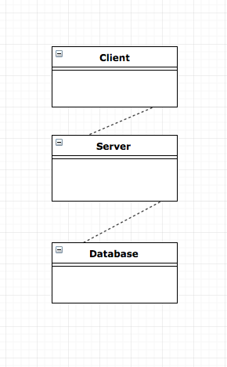
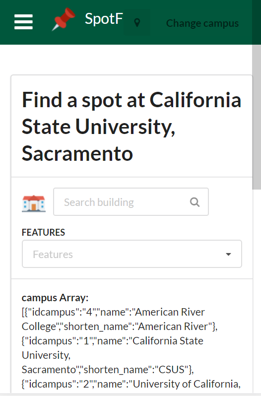
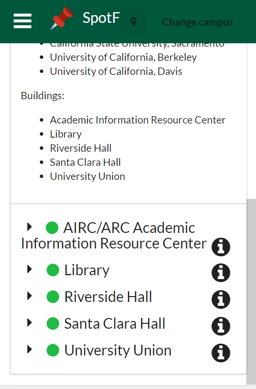
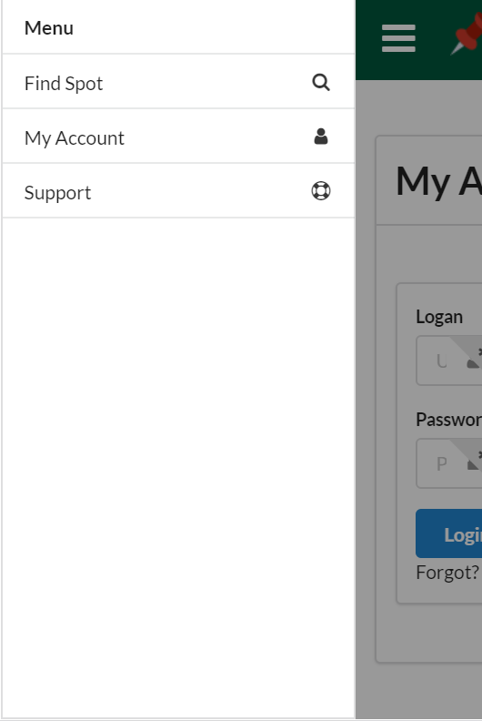
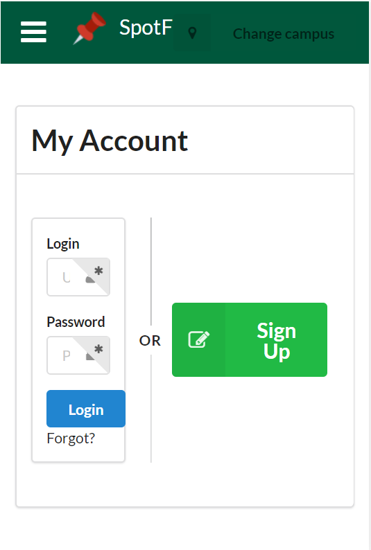
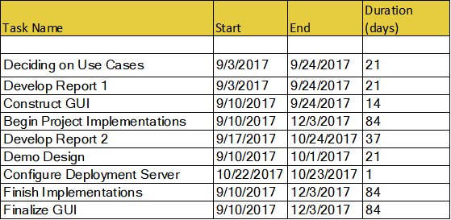
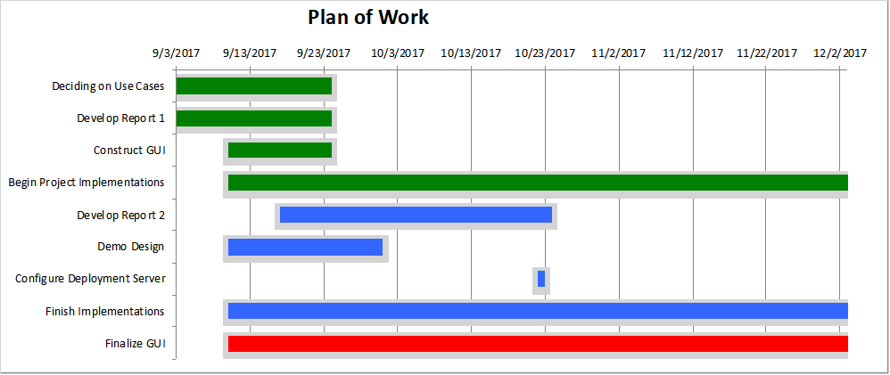

## Report 2
### Cover Page and Individual Contribution

Course title: CSC 131 Section 4 - Computer Software Engineering

Team number: 2

Team name: Team Tux

Project: Study Spot Finder

Project website: www.SpotFinder.tk

Submission date: Monday, September 25, 2017 at 5:00 PM P.D.T.

Team members:

 *  Alex
 *  Edward
 *  Luis Roman
 *  Luke
 *  Nick
 *  Tara Ross
 *  Travis Keri

### Table of contents
 * [Interation Diagrams](#interation)
 * [Class Diagram and Interface Specification](#interface)
   * [Class Diagram](#classDiagram)
   * [Data Types and Operation Signatures](#dataTypes)
 * [System Architecture and System Design](#system)
   * [Architectural Style](#architecturalStyle)
   * [Identifying Subsystems](#identifyingSubsystems)
   * [Mapping Subsystems to Hardware](#mapping)
   * [Persistent Data Storage](#data)
   * [Network Protocal](#network)
   * [Global Control Flow](#controlFlow)
   * [Hardware Requirements](#hardward)
 * [Algorithms and Data Structures](#algorithmsDataStructures)
   * [Algorithms](#algorithms)
   * [Data Structures](#dataStructures)
 * [User Interface Design and Implementation](#uIDandI)
 * [Progress Report and Plan of Work](#progressReportandPOW)
   * [Progress Report](#progressReport)
   * [Plan of Work](#planOfWork)

### Interation Diagram

**Use case 1 & 2**

**Use case 3**

We have decided to put this use case on hold, to focus on the others. If there is time to implement them we will come back to them.

**Use case 4**

**Use case 5**

**Use case 6**

**Use case 7**

### Class Diagram and Interface Specification

#### Class Diagram

#### Data Types and Operation Signatures

### System Architecture and System Design

#### Architecural Style

For our archictecture we used a central database to store all data.  It is a MYSQL database. The webserver pulls all data from this one database.

#### Identifying Subsystems

  
   
    The three subsystems are the client's browser, the server, and the database.  The client will access the server and the server retrieve data from the database. 

#### Mapping Subsystems to Hardware

    There is a server that serves a website.  
    Users are able to access the webpage with a web browser.  The UI that the user interacts with
    is run on the user's computer that is being used to visit the webpage.  The web server 
    runs on a linux machine that is being hosted remotely.  
#### Persistent Data Storage

Yes, we are using a relational database for data storage.  There are three tables.

1. Data Table     - Stores the user input as an int, and is associated with a floor and building id.

2. Building Table - Stores information about the building that will apply to all floors. 

3. Floor Table    - Stores information about each floor, and is associated with the building id. 

#### Network Protocal

We are using HTTP. We chose HTTP simply because the majority of the group had some experie with HTTP, and it is easy to work with.  This is the network protocal that our framework of choice uses. 

#### Global Control Flow

  ##### Execution Orderness

    The system is not procedure driven.  The user has the ability to select which part of
    the website that they would like to interact with.  There is no specific order that the 
    client has to interact with the website.  

  ##### Time Dependency

    There are automated algorithms that will run at specific times in the day.  
    These are realtime events that occur periodically.  The algorithms are for caching analyzed trends.

  ##### Concurrency 

    This system will run on an apache server.  That server will handle multiple requests 
    and allow for serveral users.  The users will all access the same database.  The apache php 
    will be single threaded. 

#### Hardware Requirements

    The system runs on a linux box that is remotely hosted.  The server only need about 1GB of
     space and a single core allocated to host and serve content.  To use the system, the client needs
    to have a computer capable of visiting a webpage.  

### Alorithms and Data Structures

#### Algorithms

#### Data Structures

### User Interface Design and Implementation

#### Find Spot
The user will start at the "Find a Spot" page, which will display what campus you are at and a search prompt to find desired building. Below, there is a list of all the buildings that can be clicked on to show the availability for each floor the building has.

#### Menu
The sidebar menu will be available to the user at all times.  One tap on the menu icon will pull up the menu and allow the user to easily navigate the site. Can choose between "Find a Spot", "My Account", and "Support"

#### Login Page
User can login to original account or create a new account, if they are new to the site.

#### Scenario 1: User looks for any open area nearby.
1. Navigation: 1 Total Click
* User clicks on one of the nearby listed building for information about open rooms.
2. Data Entry: None
3. Fraction of Nav vs Data Entry (Nav/Data)
* All Navigation

### Progress Report and Plan of Work

### Use Cases implemented so far:

|Implemented     |Use Case Description                               |
|----------------|---------------------------------------------------|
|**In progress** | * UC-1 User searches for open study space         |
|**In Progress** | * UC-2 User searches for study space with amenity |
|**No**          | * UC-3 User reserves a room                       |
|**In progress** | * UC-4 System logs user in                        |
|**In progress** | * UC-5 System analyzes trends                     |
|**In limbo**    | * UC-6 User input how busy an area is             |
|**Not yet**     | * UC-7 User leaves comment                        |

### UC-1
    A search bar has been added to the front page of the website. 
### UC-2
    Amenities can now be chosen through a drop down accordian menu.
### UC-3
    Reserving of rooms has not been implemented yet.
### UC-4
    Login page accessible from the side menu with option to sign up. 
### UC-5
    A working algorithm has not been started on yet.
### UC-6
    No user access but admins can change traffic status.
### UC-7
    Option for users to leave comments have not been implemented yet.
#### Plan of Work

### Breakdown of Responsibilities

|Task           |Members               |
|---------------|----------------------|
|Coordinator    |Edward                |
|JavaScript     |_Edward, Alex_        |
|HTML/CSS       |_Nick_                |
|Algorithms     |_Travis_              |
|Backend        |_Luke, Luis, Tara_    |
